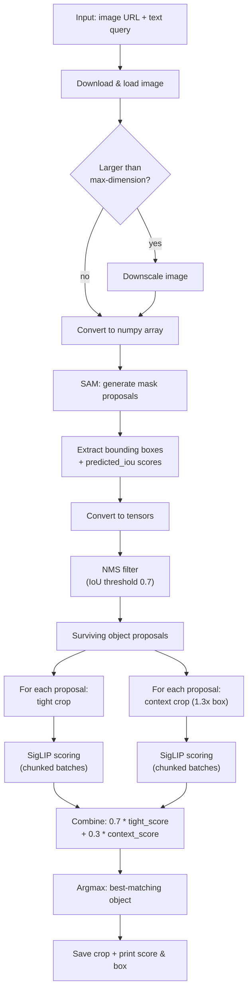
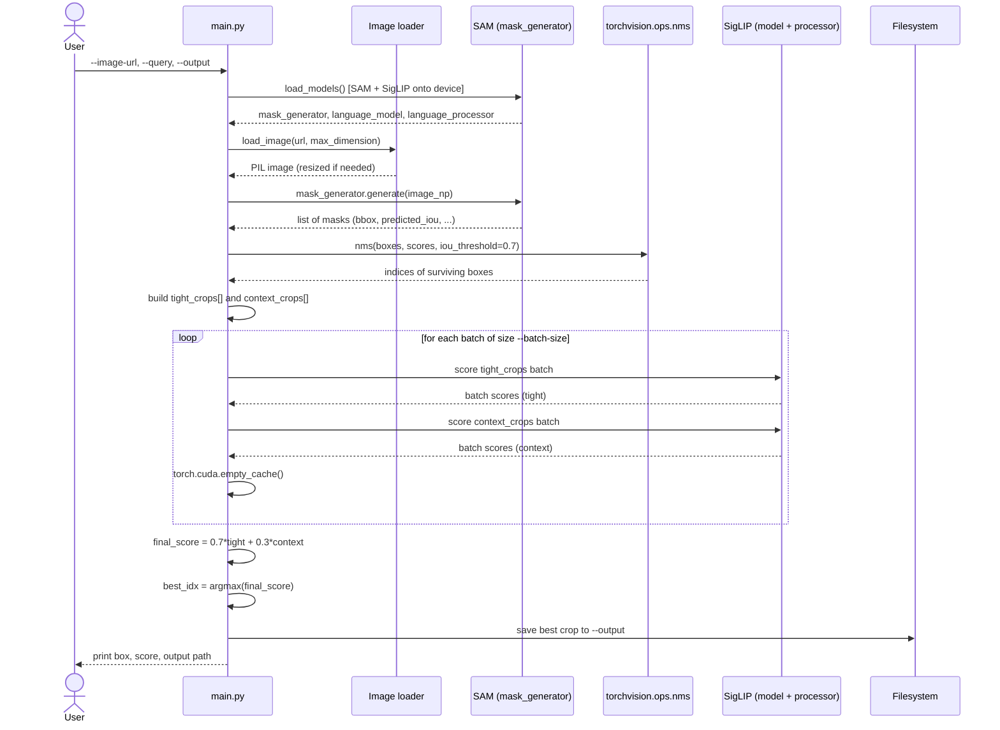
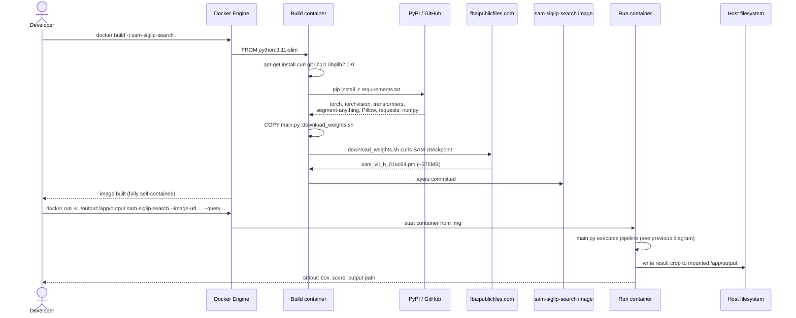
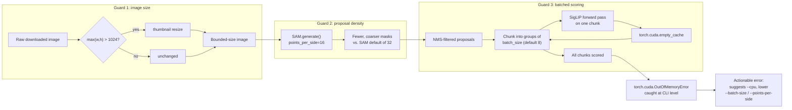

# Architecture & Development Documentation

This document explains how the SAM + SigLIP zero-shot visual search pipeline
works internally, the problems found in the original prototype and how they
were fixed, and diagrams of the system's control flow, data flow, and
deployment process.

> Diagrams use [Mermaid](https://mermaid.js.org/), which GitHub, GitLab, and
> most modern Markdown viewers render automatically — no extra tooling
> needed to view them.

---

## 1. System overview

The project answers one question: **"where is `<text query>` in this
image?"** — without any training, fine-tuning, or fixed label set.

It does this by combining two independent, pre-trained models that were
never designed to work together:

| Model | Role | Why it's needed |
|---|---|---|
| **SAM** (`segment-anything`, `vit_b`) | Class-agnostic object proposal | Finds *every* plausible object boundary in the image, with no idea what any of them are |
| **SigLIP** (`google/siglip-base-patch16-224`) | Zero-shot vision-language matching | Scores how well each proposed object matches the free-text query |

Neither model alone can do this task: SAM has no language understanding,
and SigLIP alone has no way to localize objects within an image — it can
only compare whole images to text. Chaining them turns two narrow
capabilities into open-vocabulary object localization.

---

## 2. Pipeline diagram

---

## 3. Sequence diagram — running a query

This shows the runtime interaction between the CLI, the two models, and the
filesystem for a single `python main.py --image-url ... --query ...` call.

---

## 4. Sequence diagram — Docker build & run

---

## 5. Memory-safety data flow

This is the part of the system most likely to fail on a memory-constrained
machine, and the diagram below shows where each guard rail sits.

---

## 6. Problems found and solutions

These were identified while turning the original notebook prototype into a
runnable, shareable project. Each row is something that would have failed
on a machine other than the one the notebook happened to be developed on.

| # | Problem | Why it happens | Solution implemented |
|---|---|---|---|
| 1 | `ImportError: No module named 'segment_anything'` on a fresh machine | The install cell (`Part 1`) only ran `pip install ultralytics transformers`, but the code imports `from segment_anything import ...`. `ultralytics` does not provide that module. | `requirements.txt` installs `segment-anything` directly from its GitHub source; `Dockerfile` also installs `git`, which pip needs to fetch it. |
| 2 | `FileNotFoundError` / silent failure loading `sam_vit_b_01ec64.pth` | The notebook assumes the checkpoint file already exists locally; no download step exists anywhere in the notebook. | Added `download_weights.sh`, which fetches the official checkpoint from Meta's public bucket. The `Dockerfile` runs this at build time so the image is self-contained and works fully offline afterward. |
| 3 | Notebook's install cell fails outright in network-isolated environments (e.g., Kaggle with internet disabled), but the notebook prints "✅ All libraries are ready" regardless | The `pip install` output is never checked; success is printed unconditionally. | The CLI (`main.py`) fails loudly with a real exception and exit code if models can't load, instead of a false-positive success message. |
| 4 | Potential CUDA out-of-memory during the SigLIP scoring step in crowded images | The original code builds `tight_crops` and `context_crops` lists of *all* NMS-surviving objects and sends each list through SigLIP in a **single** batched forward pass. A busy scene can yield many dozens of proposals, and this batch size is unbounded — the one place memory usage scales with image content, which the "resize to 1024px" step doesn't protect against. | Added `_score_crops_in_batches()`, which processes crops in fixed-size chunks (`--batch-size`, default 8), clearing the CUDA cache between chunks. Memory use for this stage is now roughly constant regardless of how many objects SAM finds. |
| 5 | No way to run on CPU-only or memory-constrained machines without editing code | All parameters (image size cap, SAM density, device) were hardcoded in notebook cells. | Exposed `--cpu`, `--max-dimension`, `--points-per-side`, and `--batch-size` as CLI flags so memory/quality tradeoffs can be tuned per machine without touching source. |
| 6 | Full-resolution numpy array and raw SAM mask segmentation arrays kept in memory longer than needed | The notebook keeps every intermediate object alive for the rest of the cell's execution. | `main.py` explicitly `del`s the mask list and the full-resolution numpy array as soon as their data has been extracted, followed by `gc.collect()`, before the more memory-hungry SigLIP stage runs. |
| 7 | No graceful handling of an actual OOM if it still occurs | The notebook's only error handling was a blanket `except Exception` around the entire pipeline, printing a generic message. | `main.py`'s CLI entrypoint specifically catches `torch.cuda.OutOfMemoryError` and prints actionable next steps (lower batch size / points-per-side / max-dimension, or add `--cpu`). |
| 8 | Not portable — required manually re-running install/model-loading cells per session, on a specific host with pre-placed files | Notebook-only workflow, tied to one interactive Kaggle session. | Repackaged as a CLI script + `Dockerfile`, so the exact same environment (Python version, dependency versions, model weights) is reproducible on any machine with Docker installed. |

---

## 7. Design notes / tuning knobs

- **`tight_weight` / `context_weight` (0.7 / 0.3 by default)** — controls how
  much the surrounding context of an object influences its score, versus
  the object alone. Passed as arguments to `find_best_match()` if you want
  to experiment.
- **`context_scale` (1.3x by default)** — how much wider the "context crop"
  is than the tight bounding box.
- **`points_per_side` (16 by default, SAM's own default is 32)** — directly
  trades proposal recall for speed/memory. Raise it for small/cluttered
  objects that might be missed; lower it further for very constrained
  hardware.
- **`iou_threshold` (0.7, fixed in `propose_objects`)** — NMS aggressiveness
  for removing duplicate/overlapping proposals.

## 8. Known limitations

- Zero-shot performance depends on how well SigLIP's training data covers
  the query's vocabulary and visual concept — very unusual or abstract
  queries will score poorly across all candidates.
- SAM can miss very small, heavily occluded, or low-contrast objects
  regardless of the query.
- This is a single-best-match pipeline — it doesn't currently return ranked
  top-k matches, though the `final_scores` tensor computed internally makes
  that a straightforward extension.
